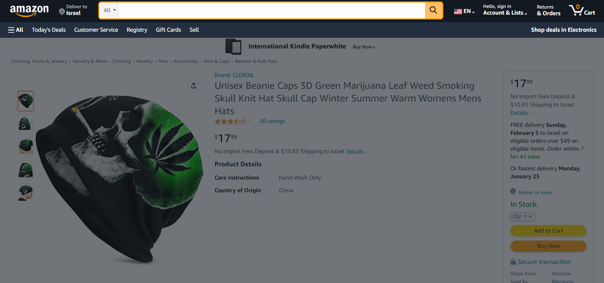
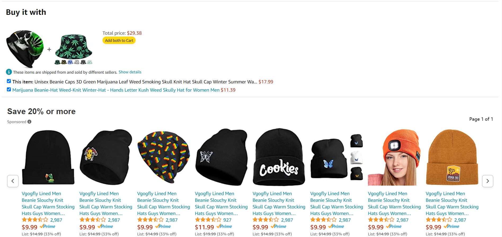

# AppleSeeds-Amazon

I was given a task @AppleSeeds Bootcamp to make a a copy of an Amazon product sale while only using ```HTML``` and ```CSS``` (And one component of ```JavaScript```)

I randomly picked a product page and copied it, the store page I made was for a Hat

My main focus was on the small details to make sure the page looks the same.

## Demo site link

https://appleseeds-amazon.netlify.app/


## Screenshots








## Deployment

To deploy this project run

```bash
  ./index.html
```
This is a basic site with only one page of ```HTML``` and ```CSS``` styling
